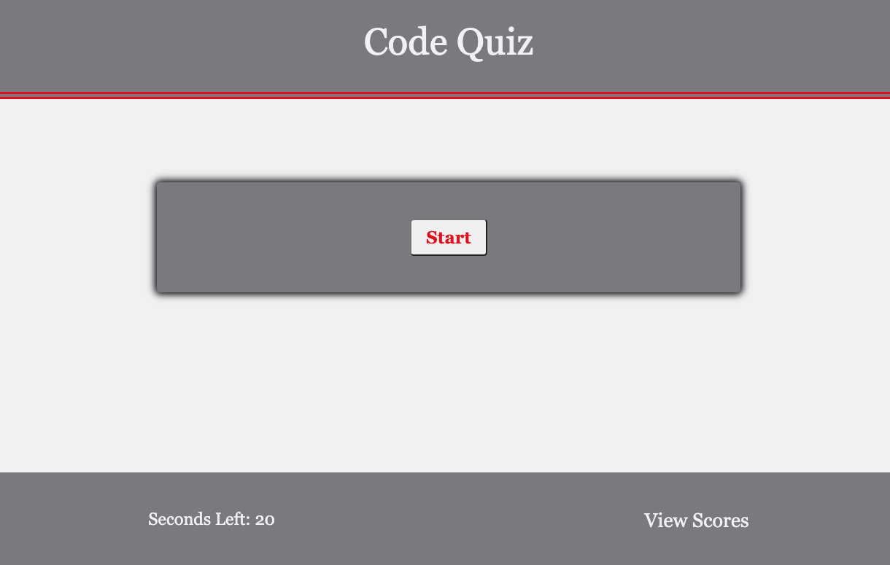

Title: Code Quiz

Usage:HTML, CSS & JavaScript

Instruction on Code Quiz
Press "Start" button & start game.

Race agaist timer to complete the quiz.
Answering correct 1 point is added.
Answeing incorrect 2 second deducted.

When done you will be prompted to enter 
your initials which will be saved on the 
Scoreboard.

Source:

to get and idea of what components to have in a Quiz Game
How to make a quiz App using HTML CSS-Vanilla javaScript
https://www.youtube.com/watch?v=f4fB9Xg2JEY

How to make a Quiz App using HTML CSS  Vanilla JavaScript Project Beginners Tutorial
https://www.youtube.com/watch?v=f4fB9Xg2JEY&list=RDCMUCsKsymTY_4BYR-wytLjex7A&start_radio=1&t=4188&t=4073

Building a Quiz App in JavaSript
https://levelup.gitconnected.com/building-a-quiz-app-in-javascript-b3f7d596855b

textContent vs innerText
https://medium.com/better-programming/whats-best-innertext-vs-innerhtml-vs-textcontent-903ebc43a3fc
https://kellegous.com/j/2013/02/27/innertext-vs-textcontent/

Hide To-Toggle Hide and Show
https://www.w3schools.com/howto/howto_js_toggle_hide_show.asp
https://developer.mozilla.org/en-US/docs/Web/API/HTMLElement/hidden

Timer
https://developer.mozilla.org/en-US/docs/Web/API/HTMLElement/hidden
https://www.youtube.com/watch?v=x7WJEmxNlEs&list=RDCMUCeU-1X402kT-JlLdAitxSMA&index=1

Render Question
https://stackoverflow.com/questions/21112521/how-to-render-text-from-javascript-object-in-html-form